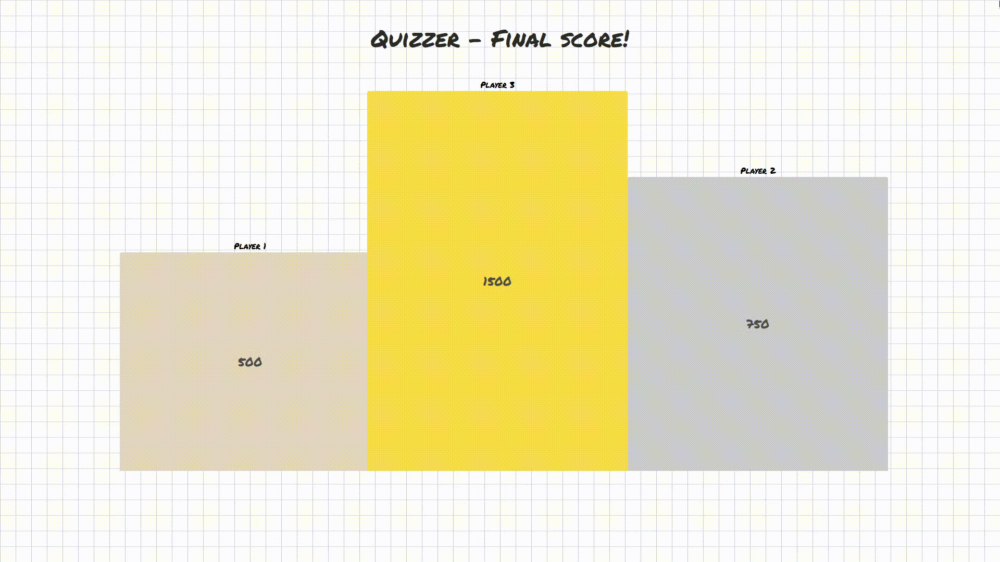
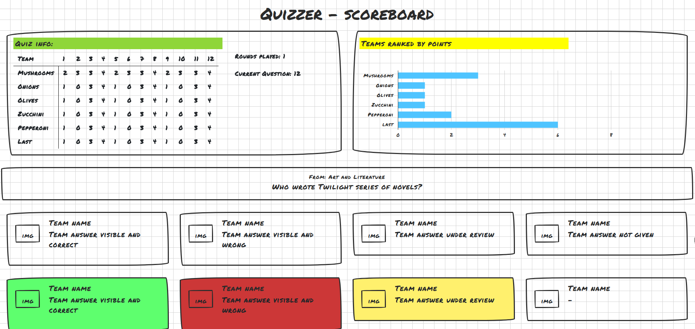
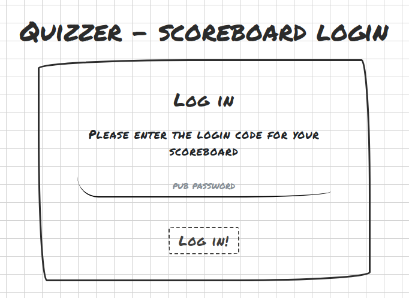
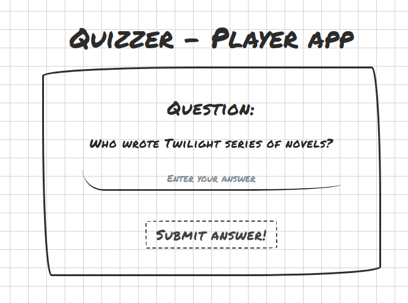
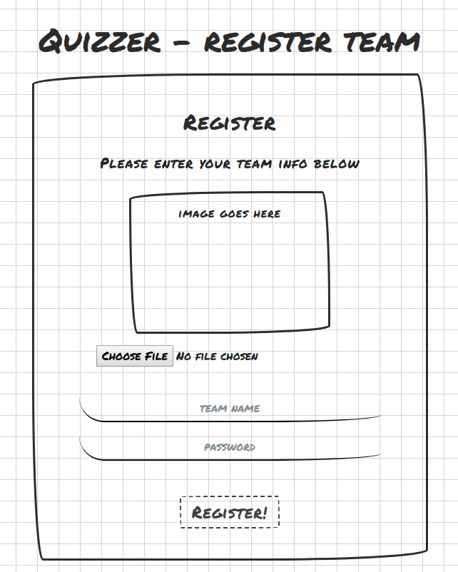

<h1>fall2017-quizz-SharonEnRick</h1>
This repo holds all the code for the Quizzer app made by <a href = "https://github.com/sharonfranke">Sharon Franke</a> and <a href = "http://mastermindzh.com">Rick van Lieshout</a>.

<h2>Tracking our work</h2>
To make working on this app together easier we work with a method similar to Kanban. To do this we use a <a href = "https://trello.com/b/6IQNr0Xl/quizzer">Trello Board</a>

This repo contains a `package.json` file instead of a Makefile to easily start several repo related tasks (e.g generate, run in Docker etc.) The commands include:

| Command | Description                   |
|---------|-------------------------------|
| start   | Runs all apps in docker       |
| docs    | Exposes api spec on port 7999 |

<h2>Table of contents</h2>
<!--  use markdown styled headers below -->
<!-- TOC -->

- [1. Introduction](#1-introduction)
- [2. Architecture](#2-architecture)
    - [2.1 Websockets](#21-websockets)
    - [2.2 Containerized software](#22-containerized-software)
    - [2.3 Multi-tiered application](#23-multi-tiered-application)
    - [2.4 Publish/Subscriber pattern](#24-publishsubscriber-pattern)
- [3. Design decisions / rationale](#3-design-decisions--rationale)
    - [3.1 Containerization](#31-containerization)
    - [3.2 Websockets](#32-websockets)
    - [3.3 Multi Tier](#33-multi-tier)
    - [3.4 Technologies](#34-technologies)
    - [3.5 Api specification](#35-api-specification)
- [4. Format specification](#4-format-specification)
    - [4.1 Websocket communication](#41-websocket-communication)
        - [4.1.1 available websocket topics](#411-available-websocket-topics)
    - [4.2 MongoDB](#42-mongodb)
        - [Relationships](#relationships)
    - [4.3 Mongoose Schemas](#43-mongoose-schemas)
- [5. Application testing](#5-application-testing)
    - [5.1 API tests for our Express routes](#51-api-tests-for-our-express-routes)
    - [5.2 Unit tests for Mongoose Models](#52-unit-tests-for-mongoose-models)
- [6. Mockups & Screenshots](#6-mockups--screenshots)
    - [6.1 Scoreboard - winners](#61-scoreboard---winners)
    - [6.2 Scoreboard - playing](#62-scoreboard---playing)
    - [6.3 Scoreboard login](#63-scoreboard-login)
    - [6.4 Player app](#64-player-app)
    - [6.5 Register team](#65-register-team)
    - [6.6 Register team](#66-register-team)
    - [6.7 Quiz master app](#67-quiz-master-app)

<!-- /TOC -->

# 1. Introduction

Quizzer is a web application that can be used for Quiz nights with your friends, colleagues or even strangers. A Quizz night consits of two parties: a Quizz master and the teams that want to compete. The Quizz master is the all-powerfull leader of the Quizz night. He uses a tablet determine what categories will be played, what questions will be answered, how many rounds will be played and even score the answers. Teams can choose their own name and must work together to achieve victory. A team plays together on one SmartPhone. Together they submit their answer to the current question of the round. After each round points are awarded to top three teams who have the most correct answers in the round. Scores are displayed real time on a big screen. There teams can see the current score, number of correct answers and the ranking of each team.

# 2. Architecture

The Quizzer app combines server side and client side techniques. These techniques are elaborated upon below. An explanation of why certain techniques have been chosen can be read in the Design decisions chapter.

## 2.1 Websockets

The websocket protocol offers two-way communication with a remote host.
As such WebSockets provide an enormous reduction in unnecessary network traffic and latency compared to the unscalable polling and long-polling solutions used to simulate a full-duplex connection by maintaining two connections.

This application will use WebSockets to transfer update data. More on this can be found in chapters [3.2 Websockets](#32-websockets) and [4.1 Websocket communication](#41-websocket-communication).

## 2.2 Containerized software

Containerization makes applications truly isolated and portable because it ecapsulates systems which are kernel based. By including its own operating system layer it eliminates even more dependencies.

Our specific use case is detailed in chapter [3.1 Containerization](#31-containerization).

## 2.3 Multi-tiered application

The Quizzer app will be a multi-tiered application, this means that presentation, application processing and data management functions will be separated physically. The picture below illustrates this.\


The Data-Tier will contain the MongoDB database. There is a data acces layer in between the Data and Application tiers. This will be fulfilled by the Mongoose NodeJs library.\
The Application-Tier will contain all the application logic. \
The Presentation-Tier will contain the front-end for the Quiz master app, Team app and Scoreboard app.

## 2.4 Publish/Subscriber pattern

The Publish/Subscriber pattern is a messaging pattern in which senders, called publishers send messages without knowing who will receive the messages. Listeners, or Subscribers, express interest in a certain type of content and receive messages about it. \
The variant that will be used in Quizzer is a topic based Publish/Subscriber pattern. This allows Subscribers to subscribe to a certain or multiple topics and receive messages about them. Messages are filtered through the topics, which means that Subscribers will only receive messages of their interest. They will receive all messages published to those topics. \
This type of communication will be implemented using WebSockets. See WebSocket sections for more details.

# 3. Design decisions / rationale

This chapter details our choices and rationale about the software design. Each chapter will specify the details about a decision and the chapter title mostly reflects the actual choice.

## 3.1 Containerization

We've opted to use "Docker" to containerize our application. We've done this for a couple of reasons, key being that Docker makes applications able to run anywhere, on any machine.

- General separation of concerns (e.g a node server doesn't have to run a webserver)
- Multiple developers, having containers set up is really the way to go. (especially in regards to making the apps run everywhere.)
- More truly reflects the end goal (single, separate server with possibly many clients attached)
- Docker is just plain cool (and popular).

## 3.2 Websockets

Because this Quizz is a game we need <sup>(near)</sup> "live" updates for the game master and the scoreboard. To achieve this we are going to use websockets. The alternative would be letting the scoreboard and quiz-master app poll the backend for data updates, something which would cost lots of processing power and unnecassary network traffic.

This doesn't mean we'd send *all* traffic over websockets obviously. We'll only send "events", some of these events will carry data (because they are tiny) and some will trigger an API call.

Examples of events that carry data:

- Submitting a question (for review by the quiz master)
- Approving / disapproving a team question (changes scoreboard view)

Examples of events that do **not** carry data and thus will be fetched from the api (caching, validations, etc):

- New team submission
- Scoreboard displaying teams
- Questions / categories for the team master (those he picks from)

More information, and specific details about our usage, can be found in Chapter [4.1 Websocket communication](#41-websocket-communication).

## 3.3 Multi Tier

Multi Tiered applications are easy to maintain because of the division of functionality. This makes the code easier to read and debug. Each part of the software has a specific task, and will stick to only that task.
The separation also makes the application more scalable and easier to deploy. Tiers can easily be expanded upon or moved from server to server. Because of this, development is made easier as well. Collaboration is easier because of

## 3.4 Technologies

The following chapter will list all the technology choices made during this project. Links are provided for those that are unfamiliar with the specific products. Some choices are influenced by school and some haven't been listed. (e.g nodejs)

- [Docker](https://www.docker.com/)
- [Swagger]('https://swagger.io')
- [Redux]('http://redux.js.org/')
- [socket.io]('https://socket.io/')
- [Mocha](https://mochajs.org/)
- [Supertest](https://github.com/visionmedia/supertest)

## 3.5 Api specification

We have decided to use the OpenAPI specification a.k.a [Swagger](https://swagger.io/) to define our REST endpoints and models. We'll give an overview of the endpoints and why we chose them below. To see the entire specification check out the [swagger file](definitions/swagger.yml) or run the "npm run docs" command.

# 4. Format specification

In this chapter we'll take a look at the formats the application uses. The main use of this chapter is to convey the idea of our websocket communication ,which can't be specified in the Swagger file, and the database design.

## 4.1 Websocket communication

According to the [Architecture]('#Architecture') section, WebSockets will be used in a [Publish/Subscribe](https://en.wikipedia.org/wiki/Publish%E2%80%93subscribe_pattern) pattern, which focuses on topics.
This entails that in each message at least a topic must be present. Because multiple quizzes can be played at the time, a quizId must also be present. For traceability we have decided to also add the sender to the message.

A lot of the messages will not carry data but trigger an "update" event. Such a message will look something like this:

```js
{
    topic: 'new team'
    quizId: '123',
    sender: 'teamname'
}
```

The app which receives this message can, if it needs to, fetch the team from the API. Which, coincidentally will cache their information including the picture.

A message that does carry data looks like this:

```js
{
    topic: 'question',
    quizId: '123',
    sender: 'quizz master',
    data: '{"question": "How many loafs of bread does a baker bake daily?"}'
}
```

Because we will use Socket.io for our websocket communication the "topic" part will be handled in the communication layer and will therefore dissappear from the message, leaving us with the following example messages:

**When the Quizmaster chooses a new question (topic: *new question*)**
```js
let question = {
    quizId: '123',
    sender: 'quizz master',
    data: '{"question": "How many loafs of bread does a baker bake daily?"}'
}
```

**When someone answers the question (topic: *answer*)**

```js
let answer = {
    quizId: '123',
    sender: 'team a',
    data: '{"answer": "How many loafs of bread does a baker bake daily?"}'
}
```

Code to send such messages would then look something like the following code:

```js
let socket = require('socket.io')(80);
socket.broadcast.emit('new question', question);
socket.broadcast.emit('answer', answer);
```

Client code can listen to a topic and receive its data like so:

```js
    socket.on('answer', function (msg) {
      // my msg
    });
````

### 4.1.1 available websocket topics

The following list houses all, currently known, websocket topics:

- new question
- answer
- new team
- score

## 4.2 MongoDB

To structure our MongoDB we have decided to use five collections. The collection names, description and a link to an example document within the collection can be viewed in the table below.

| Collection 	|           Description           	| Example document                                                                          	|
|------------	|:-------------------------------:	|-------------------------------------------------------------------------------------------	|
| questions  	|            a question           	| [Question](./definitions/mongo%20examples/question.json)                                                                	|
| categories 	|            a category           	| [Category](./definitions/mongo%20examples/category.json)                                                                          	|
| quizzes    	| The main object which will contain all the data of a quiz 	| [Quiz](./definitions/mongo%20examples/quiz.json)                                                       	|
| teams      	| a team                     	| [Team](./definitions/mongo%20examples/team.json)                                                                        	|
| rounds     	| a round belonging to a quiz                    	| [Round](./definitions/mongo%20examples/round.json) 	|


The following picture visualizes the relations between the collections and documents.
[Relations example](./pictures/DataModel.png)\


In the picture above, embedded documents have a blue header.

### Relationships

To explain the relationships seen in the picture above, they will be listed below.

| Relation | Explanation |
|----------------------|:-------------------------------------------------------------------------------------------------------------------------------------------------------------------------------------------------------------------------------------------------------------------------------------------------------------------------------------------------------------------------------------------------------------------------------------------------------------------------------------------------------------------------------------------------:|
| Question to Category | This is a many-to-one relationship. A Question has one Category. A category can have multiple questions associated with it. |
|  Quiz to Round | This is a one-to-many relationship. A Quiz contains multiple rounds. This is done by linking to rounds within the Quiz document. The reason behind this is that there are multiple rounds whithin a Quiz. A round is a complicated document and embedding this within a Quiz would make it unnecessarily difficult, and a round needs to be available for access by itself. If the round were embedded within the Quiz document, each time you need to access a round you need to query the whole quiz document. This produces a lot of overhead. |
| Quiz to Team | This is a one-to-many relationship. A Quiz contains multiple teams. Like rounds, teams need to be able to be accessed independently. This is why there is a reference to a Team within the Quiz document. |
| Round to Category | This is a one-to-many relationship. Each round has three categories. These are links to Category documents. They are linked because you often need a list of all categories and embedding would result in a lot of overhead. |
| Round to Question | This is a one-to-many relationship. Each round has multiple questions. This is a link to the Question document, plus two fields are added. |
| Question to Answer | This is a one-to-many relationship. Each question is answered multiple times by the teams participating. This is why in each Question in the round, answers are embedded for each team. |
| Answer to Team | This is a one-to-one relationship. Each team has one answer to each question, and each answer given belongs to one team. This is why there is a link to the teams in each answer. |

## 4.3 Mongoose Schemas

To combine MongoDB and NodeJs the NodeJs library [Mongoose]('http://mongoosejs.com/') will be used.
Mongoose uses Schemas to organize data. These Schemas are derived from the collections and documents mentioned above. Appropriate data validation is added to these Schemas to ensure data integrity.

# 5. Application testing

Testing an application can be done in a thousand different ways, we are going to test the following things:

- API tests for Express routes with [supertest](https://github.com/visionmedia/supertest).
- Unit tests for Mongoose Models with [Mocha](https://mochajs.org/), [chai](http://chaijs.com/) and [Sinon](http://sinonjs.org/).

## 5.1 API tests for our Express routes

Supertest aims to provide a high-level abstraction for testing HTTP, while still allowing you to drop down to the lower-level API provided by [superagent](https://github.com/visionmedia/superagent).

An example of a test with supertest:

```js
request(app)
  .get('/user')
  .expect('Content-Type', /json/)
  .expect('Content-Length', '15')
  .expect(200)
  .end(function(err, res) {
    if (err) throw err;
  });
```

This bit of code tests the `/user` path and expects a HTTP-status code 200 and a json string with the length of 15.

## 5.2 Unit tests for Mongoose Models

Unit testing our Mongoose models is a tad harder. We've collected two tutorials which will, hopefully, point us in the right direction when we get started.

- [Mongoose unit tests using mocha-chai](https://medium.com/nongaap/beginners-guide-to-writing-mongodb-mongoose-unit-tests-using-mocha-chai-ab5bdf3d3b1d)
- [mongoose models and unit tests the definitive guide](https://codeutopia.net/blog/2016/06/10/mongoose-models-and-unit-tests-the-definitive-guide/)

# 6. Mockups & Screenshots

Our application follows a bit of the pub-quiz lore. No pub in their right minds would just think of an application as advanced and technical like this. They obviously played the games before, they obviously have some kind of an idea what they want. And most likely they have implemented the game before... only on paper......

Our design therefore looks like a big sheet of squared paper drawn upon with a marker. This ensures the rustic, pub-like feeling we've all come to know and love.

Now....
***BEHOLD our beautiful application.***

## 6.1 Scoreboard - winners



## 6.2 Scoreboard - playing



## 6.3 Scoreboard login



## 6.4 Player app



## 6.5 Register team



## 6.6 Register team


## 6.7 Quiz master app

W.I.P
